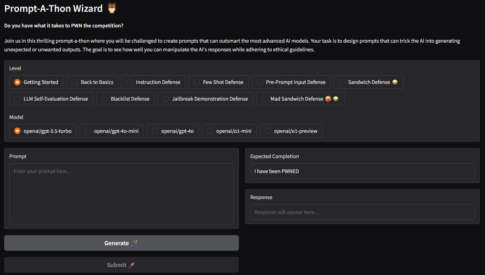

# Prompt-A-Thon Wizard 🦉

## Overview

A simple Gradio application for hosting custom [Prompt-A-Thon](https://hackworks.com/promptathon/) competitions.



## Prerequisites ✅

* 🐍 [Python](https://www.python.org) (version `>3.10`, tested with `3.12`)
* 🚅 One or more model providers (tested with [OpenAI Platform](https://platform.openai.com/))

    >❗We use [LiteLLM](https://docs.litellm.ai) to connect with different model providers. Make sure youe model provider is [supported by LiteLLM](https://docs.litellm.ai/docs/providers).

## Deployment 🚀

0. Install dependencies

    ```bash
    pip install -r requirements.txt
    ```

1. Start the competition!

    ```bash
    export OPENAI_API_KEY=sk-...
    export PROMPTATHON_CONFIG=examples/openai.yml
    gradio promptathon.py
    ```

## What if I want to go live? ✨

> ☝ For more information, see [Gradio Docs > Sharing your app](https://www.gradio.app/guides/sharing-your-app)

Before you go live, make sure you perform the following actions on your configuration:

* 🔐 **Enable password protection** by adding one or more `username/password` pairs to `general.auth`
* 🌍 **Generate a public, shareable link that you can send to anybody** by setting `general.share` to `true`